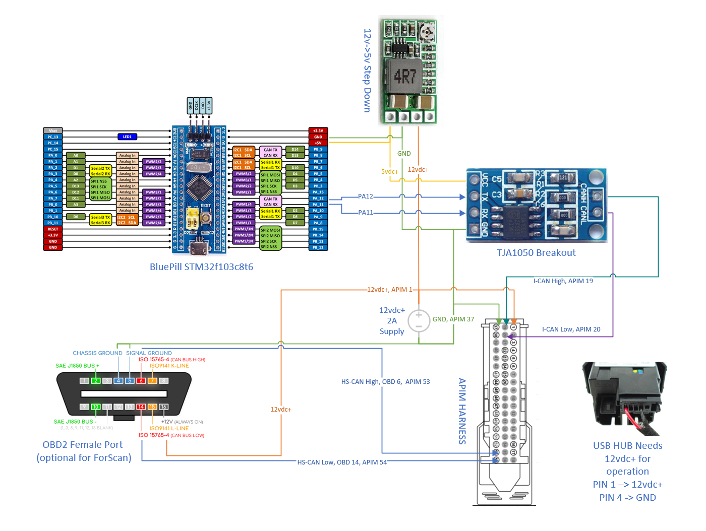

# stm32_can_sim

**Function**

Emulate CAN Bus Messages to force a Ford Sync 3 (TM) APIM to turn on outside of a car using a cheap STM32 BluePill board.  

**Why?**

In order to bench test, security test and upgrade an APIM it is desirable to have it actually turn on outside of the car and in the comfort of an office. Existing bench testing cable solutions can be bought at a ridiculous price ($150+) and are missing functionality. It is much more fun to build your own test harness. 

**Wiring**

 2/3/2022  NOTE: APIM pin 19 with pin 53 and 
                 pin 20 with pin 54 may need to be merged in order to enable ForScan programming on the bench with some APIMs

 - PA11 Bluepill, CAN H -> TJA1050 RX 
 - TJA1050 CAN H -> APIM I-CAN H, PIN 19
 - PA12 Bluepill, CAN L -> TJA1050 TX
 - TJA1050 CAN L -> APIM I-CAN L, PIN 20
 - OBD 06 -> APIM HS CAN H, PIN 53
 - OBD 14 -> APIM HS CAN L, PIN 54
 - GND -> buck gnd / APIM, PIN 37 / TJA1050
 - 12vdc+ -> buck in + / USB Port / OBD2, Pin 16 / APIM, PIN 1
 - 5vdc+ out from buck -> TJA1050 / BluePill 5vdc+ in

**Required Hardware**

 - STM32f103 BluePill board - $10 - avoid fake STM32f103 Chinese knock-offs
 - ST-Link v2 - $5 - used for programming the STM32
 - TJA1040 $5 - can bus break out board, translates STM32 signals to CAN Bus signals 
 - APIM connector - $10? - use an OEM cut harness or a harness extension cable from Ali 
 - 12v->5v  - buck step-down converter - $2
 - 12vdc / 2a power source
 
Total: $32

**Optional Hardware**
 - Empty female OBD2 header - $5
 - ELS27 v4 (real) $75 - best option for ForScan
 -  OR
 - Chinese ELM327 Cable With MS/HS switch - $10? - these vary greatly in quality and functionality
 - ForScan - free 2mo license - to make changes to APIM power board configuration
 - Extended length LVDS cable - $8 - Super short cable that typically comes with APIM is hard to use on the bench

**Compiling**

You will need to use these
 - VSCode
 - PlatformIO
 - Arduino Framework 
 - exothink/eXoCAN 1.0.3 
 
**ForScan**

To use ForScan you in order to change the AsBuilt data stored on the APIM power board you need to connect the APIM to an ELM327 or ELS327 cable. 
ForScan will complain that it is not able to read from the type of car from the ECU and will ask to load a per-existing profile. A profile that was previously saved can then be loaded and the APIM AsBuilt module settings can then be accessed and modified.

**OEM USB Hub** 

The USB Hub is needed in order to install updates to the APIM. You only need 2 wires + a USB cable to use it. DuPont test wires work fine in lieu of a real power connector.
USB PIN 1 is labeled inside the connector.
 - USB PIN 1 -> 12vdc+ 
 - USB PIN 4 -> GND
