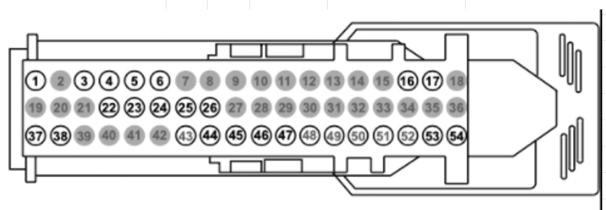

# stm32_can_sim

Emulate CAN Bus Messages for bench testing / turning on a Ford Sync 3 APIM using a cheap Bluepill board 

**Required Hardware:**

 - STM32f103 Bluepill board - $10 - avoid fake STM32 Chinese knock-offs
 - ST-Link v2 - $5 TJA1040 can bus break out board 
 - APIM connector  - $10? - use an oem cut harness or an extension cable from Ali 
 - 12v-5v  - buck converter - $2

Total: $27

**Optional Hardware:**

 - Empty female OBD2 header - $5 ELS27 v4 (real) 
 - $75 - best option for  forscan 
 - OR
 - Chinese ELM327 Cable With MS/HS switch - $10? - these vary
   greatly in quality and functionality
 - ForScan - free 2mo license - to make changes to APIM power board
   configuration   
 - Extended length LVDS   cable - $8 - Super short cable that typically comes with APIM is hard
   to use on the bench

**Wiring:**

PA11 Bluepill, CAN H -> TJA1050 RX 
TJA1050 CAN H -> APIM ICAN H,PIN 19

PA12 Bluepill, CAN L -> TJA1050 TX
TJA1050 CAN L -> APIM ICAN L,PIN 20

OBD 06 -> APIM HS CAN H, PIN 53
OBD 14 -> APIM HS CAN L, PIN 54

GND -> buck gnd / APIM, PIN 37 / TJA1050
12v+ -> buck in + / USB Port / OBD2, Pin 16 / APIM, PIN 1
5v+ out from buck -> TJA1050 / Bluepill 5v in

**OEM USB Hub** 

You only need 2 wires + a USB cable to turn this on, dupont test wires work fine in lieu of a real connector.
USB PIN 1 is labeled inside the connector.
 - USB PIN 1 -> +12v 
 - USB PIN 4 -> GND
